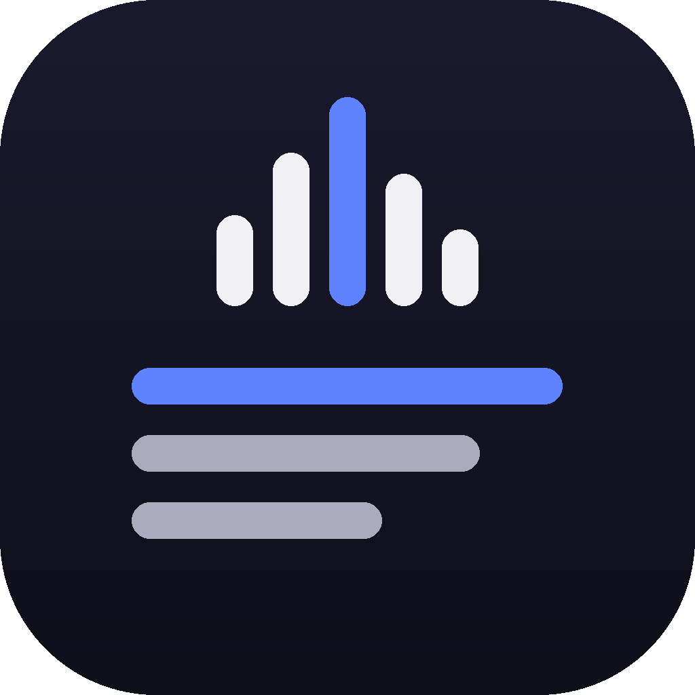
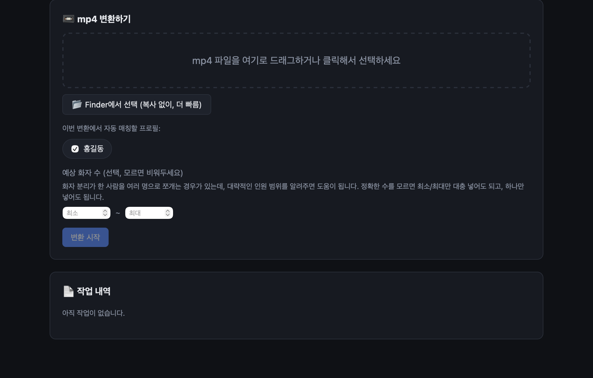

<p align="center">
  
</p>

<p align="center">
  <a href="README.md">English</a> | <b>한국어</b>
</p>

<h1 align="center">video2text</h1>

<p align="center">Webex 녹화본을 로컬에서 화자 분리 텍스트로 — 인터넷에 아무것도 올리지 않습니다.</p>

<p align="center">
  <a href="https://github.com/neurosamAI/video2text/releases/latest">
    
  </a>
</p>

<p align="center">
  
</p>

mp4 파일(주로 Webex 녹화본)을 넣으면 화자 분리(diarization)된 텍스트 전사본을 만들어주는 완전 로컬 앱입니다.
온라인 회의(화면 분할)든 오프라인 회의 녹화(단일 카메라 + 믹스된 오디오)든, 오디오 트랙 하나에 여러 화자가 섞여
들어온다는 점은 동일하므로 같은 파이프라인(오디오 기반 화자 분리)으로 처리합니다.

모든 처리(음성 인식, 화자 분리)는 이 Mac(Apple Silicon) 안에서 로컬로 실행되며, 업로드한 파일이 외부로 전송되지
않습니다. 단, 처음 실행 시 각 AI 모델 가중치를 HuggingFace / Apple(mlx-community)에서 한 번 다운로드합니다.

---

## 다운로드해서 바로 쓰기

코드를 빌드할 필요 없이, 완성된 앱을 받아서 바로 쓸 수 있습니다.

### 1. 앱 다운로드

**[Releases 페이지](https://github.com/neurosamAI/video2text/releases/latest)** 에서 `video2text-vX.Y.Z-macos-arm64.zip`을
내려받아 압축을 풉니다. `video2text.app`을 원하는 곳에 두면 됩니다 (`/Applications`로 옮기면 다른 앱들과 같은 방식으로 관리할 수 있습니다).

> Apple Silicon Mac(M1 이상), macOS 12 이상 전용입니다. Intel Mac에서는 동작하지 않습니다.

### 2. 실행

`video2text.app`을 더블클릭합니다. 네이티브 앱 창이 뜨고, 브라우저 없이 바로 사용할 수 있습니다.

macOS가 "확인되지 않은 개발자" 경고를 띄우면, Finder에서 앱을 **우클릭 → 열기**로 한 번만 허용해주세요.

이 앱은 완전히 독립된 번들입니다 — 자체 Python 런타임과 자체 ffmpeg(Homebrew 등 별도 설치 불필요)를 담고 있어서,
받은 그대로 실행됩니다.

### 3. 화자 분리 모델 접근 권한 설정 (최초 1회, 필수)

화자 분리에 쓰는 `pyannote/speaker-diarization-3.1`은 HuggingFace의 gated 모델이라, 무료 계정과 라이선스 동의,
액세스 토큰이 필요합니다.

1. https://huggingface.co/join 에서 무료 계정 생성 (이미 있으면 생략)
2. 아래 두 모델 페이지에서 각각 "Agree and access repository" 클릭해 라이선스 동의
   - https://huggingface.co/pyannote/speaker-diarization-3.1
   - https://huggingface.co/pyannote/segmentation-3.0
3. https://huggingface.co/settings/tokens 에서 "New token" → Read 권한으로 토큰 생성
4. 앱을 열면 맨 위 "설정" 카드에 토큰 입력창이 있습니다. 발급받은 토큰을 붙여넣고 저장하세요.

이 앱을 다른 Mac에서도 쓰려면, 그 Mac에서도 (본인 계정으로) 이 절차를 한 번씩 반복해야 합니다 — 라이선스 동의가
계정 단위라 토큰을 공유해서 넣어둘 수 없습니다.

### 4. 사용법

1. **내 목소리 프로필 등록** (선택사항, 하지만 추천): 이름을 입력하고 "녹음해서 등록" 또는 오디오/영상 파일을 업로드합니다.
   화면에 뜨는 문장을 조용한 곳에서 10\~20초 정도 또렷하게 읽으면 됩니다. 등록해두면 이후 변환 결과에서 해당 화자가
   자동으로 "화자 1" 대신 등록한 이름으로 표시됩니다. 여러 사람(동료 등)도 등록해서 함께 매칭할 수 있습니다.
2. **mp4 변환**: 파일을 드래그하거나, "Finder에서 선택"(복사 없이 원본 위치에서 바로 사용)으로 선택한 뒤, 이번
   변환에서 매칭할 프로필을 체크하고 "변환 시작"을 누릅니다. 참석자 수를 대략이라도 알면 "예상 화자 수"에 넣어두면
   화자 분리 정확도에 도움이 됩니다.
3. 진행 상황(오디오 추출 → 화자 분리 → 음성 인식 → 화자 매칭 → 완료)이 실시간으로 표시됩니다.
4. 완료되면 TXT / SRT / JSON 형식으로 결과가 저장됩니다 (기본 위치: `~/Downloads/video2text`, 설정에서 변경 가능).
   - TXT: `[00:12:34] 홍길동: 안녕하세요...` 형태의 읽기 편한 전사본
   - SRT: 영상 자막용
   - JSON: 화자별 블록 + 타임스탬프 원본 데이터

### 처리 시간 참고

Apple Silicon(M2 Pro 기준)에서 화자 분리는 오디오 길이의 약 10\~30%, 전사는 대체로 실시간보다 빠릅니다.
예: 2시간 녹화 → 화자 분리 15\~40분, 전사 10\~20분 내외 (파일/모델에 따라 달라질 수 있음).

### 문제 해결

- **"HF_TOKEN이 설정되지 않았습니다"**: 위 "화자 분리 모델 접근 권한 설정" 절차를 진행하세요.
- **403 / gated repo 오류**: 두 모델 페이지에서 라이선스 동의를 안 했거나, 토큰에 Read 권한이 없는 경우입니다.
- **첫 실행이 느림**: 모델 가중치를 처음 다운로드하는 중입니다 (수백 MB\~1GB대). 이후 실행부터는 캐시되어 빨라집니다.

---

## 개발자를 위한 안내

여기서부터는 코드를 직접 수정하거나 빌드하려는 개발자를 위한 내용입니다.

### 구성

- **화자 분리**: [pyannote.audio](https://github.com/pyannote/pyannote-audio) (`pyannote/speaker-diarization-3.1`)
- **음성 인식**: [mlx-whisper](https://github.com/ml-explore/mlx-examples/tree/main/whisper) (Apple Silicon Metal 가속, `large-v3-turbo`)
- **내 목소리 자동 매칭**: SpeechBrain ECAPA-TDNN 화자 임베딩으로 등록된 목소리와 화자분리 결과를 비교
- **백엔드**: FastAPI (로컬 웹 서버)
- **데스크톱 셸**: pywebview (네이티브 macOS 창) — `video2text.app`

### 개발용 vs 배포용

- **개발**: 이 프로젝트 폴더(`app/`, `static/`)에서 코드를 수정하고, 아래처럼 직접 서버를 띄워 테스트합니다.
- **배포(패키징)**: `./build.sh`를 실행하면 `video2text.app`이 만들어집니다 — 자체 Python 런타임과 모든 의존성
  (torch, mlx-whisper, pyannote.audio, speechbrain, fastapi, pywebview 등)이 `Contents/Resources/venv` 안에
  통째로 들어가고, 앱 코드도 `Contents/Resources/app`, `Contents/Resources/static`에 복사되어 **완전히 독립된
  번들**이 됩니다 (이 프로젝트 폴더를 지우거나 옮겨도, `video2text.app`을 `/Applications`로 옮겨도 그대로 동작).
  `.app` 자체의 뼈대(`Info.plist`, 실행 스크립트, 아이콘)는 `packaging/`에 있고, `video2text.app/`은 전부
  `build.sh`가 만들어내는 빌드 산출물이라 저장소에는 포함되지 않습니다.
  (프로젝트 루트의 `.venv`는 실제로는 `video2text.app/Contents/Resources/venv`를 가리키는 심볼릭 링크라서,
  개발용 venv와 배포용 venv가 같은 실체를 공유합니다 — 수 GB짜리 ML 의존성을 두 벌 유지할 필요가 없습니다.)

코드를 수정한 뒤 배포용 앱에 반영하려면:

```bash
./build.sh
```

이 스크립트는 `app/`, `static/`, `packaging/`을 번들 안으로 다시 복사하고(Python 런타임/ffmpeg는 최초 1회만
다운로드) 최신 상태로 맞춰줍니다.

### 설치 (최초 1회)

```bash
python3.11 -m venv .venv
./.venv/bin/pip install -r requirements.txt
```

또는 그냥 `./build.sh`를 실행하면 venv 생성 + 의존성 설치 + 앱 번들 동기화까지 한 번에 됩니다.

(Python 3.11 권장 — 3.13/3.14는 일부 ML 패키지 호환성 문제가 있을 수 있습니다.)

개발 중 HF 토큰은 `~/Library/Application Support/video2text/.env`에 저장되며 (`.env.example` 참고),
프로젝트 루트의 `.env`도 대체 경로로 함께 인식합니다 — 단, 개발용/배포용 앱이 항상 같은 토큰을 보게 하려면
Application Support 경로 쪽을 권장합니다.

### 소스에서 바로 실행 (터미널)

```bash
./run.sh
```

그다음 브라우저에서 http://127.0.0.1:8765 접속.

### 다른 Mac에 배포하기

`video2text.app`은 완전히 독립적입니다 — 자체 Python 런타임(Homebrew 불필요)과 자체 ffmpeg(dylib까지 전부
포함, Homebrew 불필요)를 담고 있어서, **다른 Apple Silicon Mac에 `video2text.app`만 복사(AirDrop 등)해도
별도 설치 없이 바로 실행**됩니다. GitHub Releases에 새 버전을 올리려면:

```bash
./build.sh
ditto -c -k --sequesterRsrc --keepParent video2text.app video2text-vX.Y.Z-macos-arm64.zip
gh release create vX.Y.Z video2text-vX.Y.Z-macos-arm64.zip --title "video2text vX.Y.Z" --notes "..."
```

Intel Mac에는 배포할 수 없습니다 (torch/mlx 등이 Apple Silicon용으로 빌드되어 있음).

## 라이선스

이 프로젝트 자체 코드는 [MIT License](LICENSE)입니다. 실행 중 자동으로 내려받는 AI 모델의 라이선스는 각각 다음과 같습니다 (모델 가중치는 저장소에 포함되지 않고, 각 사용자가 직접 내려받습니다):

| 모델 | 용도 | 라이선스 |
|---|---|---|
| `pyannote/speaker-diarization-3.1` | 화자 분리 | MIT |
| `pyannote/segmentation-3.0` | 화자 분리(내부) | MIT |
| `mlx-community/whisper-large-v3-turbo` | 음성 인식 | MIT |
| `speechbrain/spkrec-ecapa-voxceleb` | 화자 임베딩(프로필 매칭) | Apache 2.0 |

참고: SpeechBrain 모델 카드는 학습에 쓰인 VoxCeleb 데이터셋 자체의 라이선스는 별도로 명시하지 않습니다 — 모델 사용 자체는 Apache 2.0으로 문제없지만, 이 지점은 아직 업계 전반에서 명확히 정리되지 않은 부분입니다.
